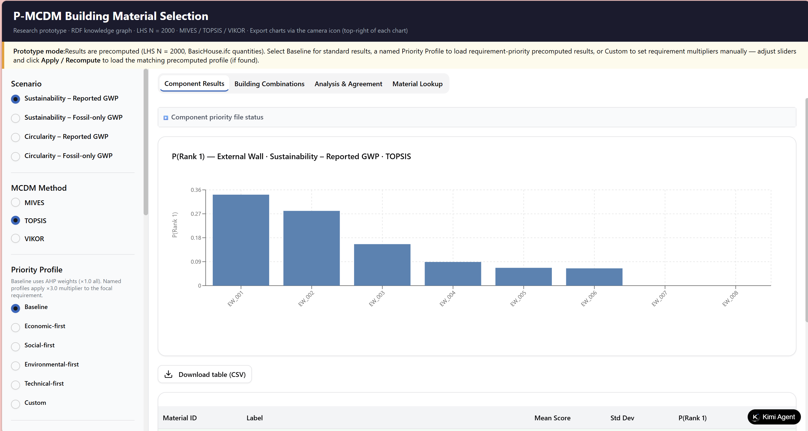
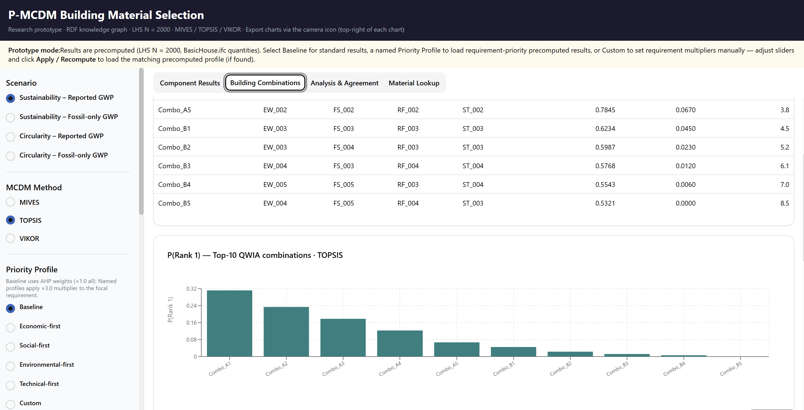
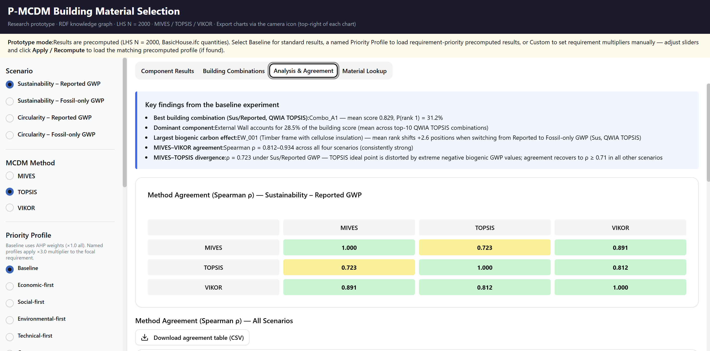
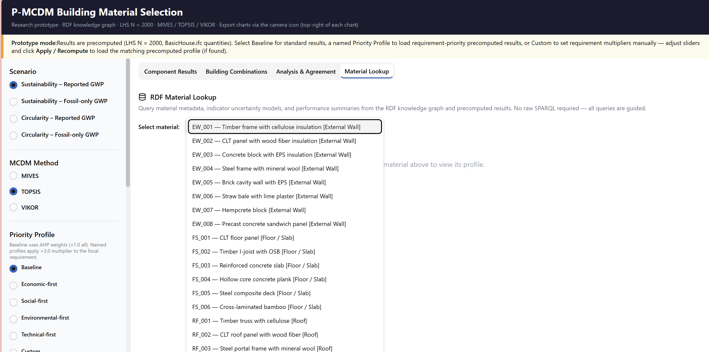

# 🏗️ P-MCDM Building Material Selection

[](https://YOUR_USERNAME.github.io/p-mcdm-web-demo/)
[](https://react.dev/)
[](https://www.typescriptlang.org/)
[](https://vitejs.dev/)

> **Probabilistic Multi-Criteria Decision Making for Sustainable Building Material Selection**
> 
> 面向可持续建筑材料选择的概率多准则决策分析工具

🌐 **Live Demo** : https://zj7wbusagkqle.ok.kimi.link/

---

## ✨ Features 

### 📊 Component-Level Analysis 

Analyze building components individually with probabilistic rankings:

- **External Wall** 
- **Floor Slab** 
- **Roof** 
- **Structural Frame** 

Each component displays:
- Score distributions with box plots 
- Probability of Rank 1, P(Rank=1) 
- Mean scores and standard deviations 
### 🏢 Building Combinations Assessment 

- Multi-component performance analysis 
- Pareto frontier visualization
- Component contribution decomposition 
- Sensitivity heatmaps 

### 🔬 MCDM Method Comparison 

Three Multi-Criteria Decision Making methods supported:

| Method | Description 
|--------|-------------
| **MIVES** | Weighted Utility Function 
| **TOPSIS** | Technique for Order Preference by Similarity to Ideal Solution 
| **VIKOR** | VlseKriterijumska Optimizacija I Kompromisno Resenje 

Includes method agreement analysis with Spearman correlation coefficients 

### 🌱 Biogenic Carbon Impact Analysis 

- Reported GWP vs Fossil-only GWP comparison
- Visualization of ranking shifts due to biogenic carbon accounting

### 📋 Scenarios & Priority Profiles 

**Scenarios**:
- Sustainability × Reported/Fossil-only GWP 
- Circularity × Reported/Fossil-only GWP 

**Priority Profiles** 
- Baseline (equal weights)
- Economic-first (Economic ×3.0) 
- Environmental-first (Environmental ×3.0) 
- Social-first (Social ×3.0) 
- Technical-first (Technical ×3.0) 

Custom weights via interactive sliders 

---

## 🖼️ Screenshots 

| Component Results | Building Combinations |
|:---:|:---:|
|  |  |


| Method Analysis | Material Lookup |
|:---:|:---:|
|  |  |


---

## 🚀 Quick Start

### Live Demo 
Access the deployed version on Kimi：
👉 https://zj7wbusagkqle.ok.kimi.link/

### Local Development 

```bash
# Clone the repository 
git clone https://github.com/YOUR_USERNAME/p-mcdm-web-demo.git
cd p-mcdm-web-demo

# Install dependencies 
npm install

# Start development server 
npm run dev

# Build for production 
npm run build
```

### GitHub Pages Deployment 

This project is configured for automatic deployment via GitHub Actions 

1. Fork this repository
2. Go to **Settings → Pages**
3. Select **"GitHub Actions"** as Source
4. Visit `https://YOUR_USERNAME.github.io/p-mcdm-web-demo/`

---

## 🛠️ Tech Stack 

| Category | Technology 
|----------|------------
| Frontend Framework | React 19 + TypeScript 
| Build Tool | Vite 7 
| Styling | Tailwind CSS 3.4 
| UI Components | shadcn/ui 
| Charts | Plotly.js + Recharts 
| Icons | Lucide React 

---

## ⚠️ Important Notice 

### Research Prototype Declaration 

> **This demonstration uses mock data for interface display only.** All material scores, rankings, and statistical indicators are randomly generated demonstration data and do not represent actual calculation results.
> 

### Core Algorithms 

This repository contains frontend code only 

| Included ✅ | Not Included ❌ |
|-------------|----------------|
| User Interface  | MCDM Core Algorithms  |
| Data Visualization| RDF Knowledge Graph Engine  |
| Interactive Logic  | LHS Sampling Computation  |

The complete research codebase will be open-sourced after paper publication 

---


### Citation 

If you use or reference this work in your research, please cite:

```bibtex
@article{pmcdm2025,
  title={P-MCDM: Probabilistic Multi-Criteria Decision Making for Sustainable Building Material Selection},
  author={[Authors]},
  journal={[Journal]},
  year={2025},
  publisher={[Publisher]}
}
```

---

## 📬 Contact 

- 📧 **Email**: y.meng@tees.ac.uk
- 🏫 **Institution** :Teesside University
- 🔗 **Website** : https://research.tees.ac.uk/en/persons/yiping-meng/

---

## 📜 License 

This project is licensed under the [Creative Commons Attribution-NonCommercial-NoDerivatives 4.0 International (CC BY-NC-ND 4.0)](https://creativecommons.org/licenses/by-nc-nd/4.0/) 

You are free to:
- ✅ **Share** — copy and redistribute the material in any medium or format 
- ✅ **Attribute** — You must give appropriate credit 

Under the following terms:
- ❌ **NonCommercial** — You may not use the material for commercial purposes 
- ❌ **NoDerivatives** — You may not modify or transform the material 

See the [LICENSE](./LICENSE) file for full license text 

---

## 🙏 Acknowledgments 

- Built with [shadcn/ui](https://ui.shadcn.com/) component library 
- Charts powered by [Plotly.js](https://plotly.com/javascript/) 
- Thanks to all peer reviewers for their feedback and suggestions 

---

<div align="center">

**⭐ If this project helps you, please give it a Star!**

Made with ❤️ for sustainable construction research

</div>
